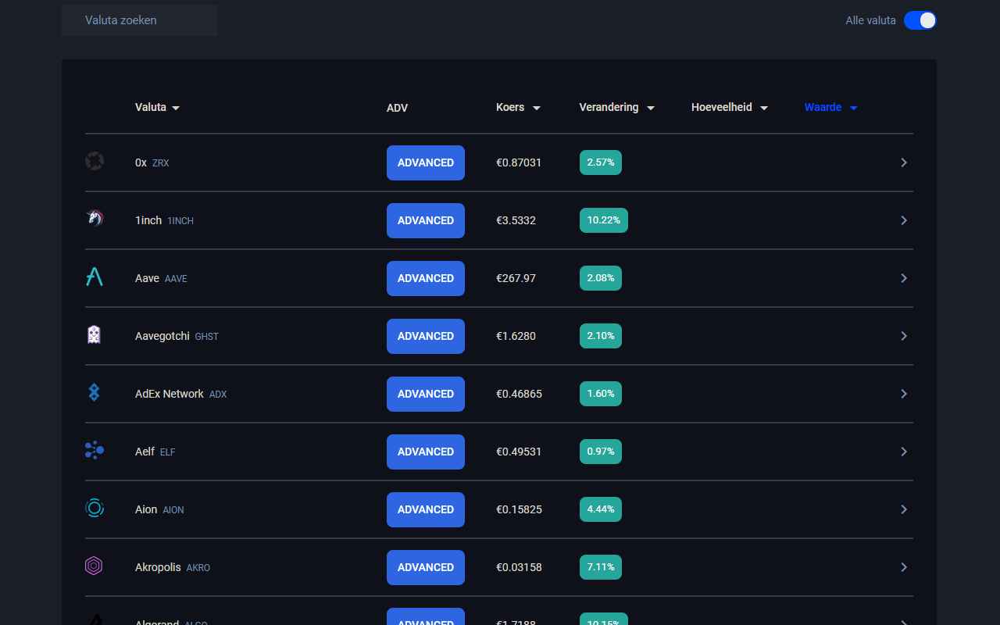

# Bitvavo-Darker

> [Bitvavo-Darker](https://chrome.google.com/webstore/detail/bitvavo-darker/onmgeopeamjlblpjlkleilnbclfdnkol) "the best bitvavo darktheme chrome extension"

## Installation

 To install Bitvavo-Darker go to the following URL: [`Bitvavo-Darker`](https://chrome.google.com/webstore/detail/bitvavo-darker/onmgeopeamjlblpjlkleilnbclfdnkol)

When on this page press the ``Add to Chrome`` button and Bitvavo-Darker will be installed :clap:

## Features 
- Dark theme :zap:
- Advanced screen easy redirect button 🔮

## Contributing
#### adding code
Just submit a pull request :smile:

## Author
Made with :heart: by [antmaster2001](https://github.com/antmaster2001)
